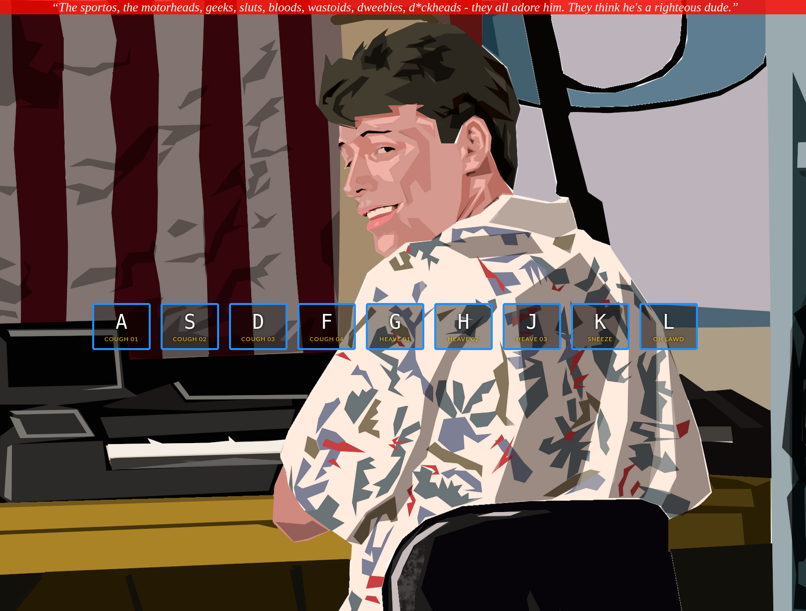

# JavaScript30 - Excercise 1: JS Drum Kit
## Bueller Board

This is a slightly customized version of the first excercise from [Wes Bos's JavaScript30](https://javascript30.com/).

The site can be viewed on GithubPages [here](https://nealbrophy.github.io/js30-bueller-board/index.html) though the keypresses register a little slow at times. For better performance clone the repo and run it locally.

### How to run locally
1. Clone or download this repo
	- `git clone https://github.com/nealbrophy/js30-bueller-board` in terminal
	- Click on the *Code* button above and select *Download ZIP*
2. If you downloaded a ZIP, extract it somewhere
3. Double click on `index.html` or in your browser of choice hit `Ctrl+O` and select the `index.html` file in the pop-up.

